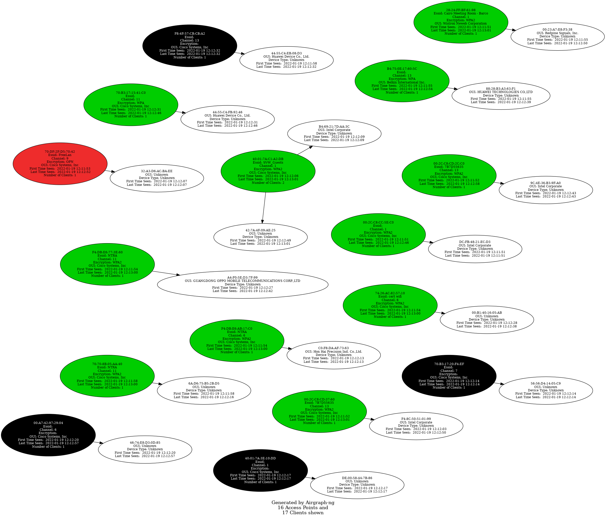
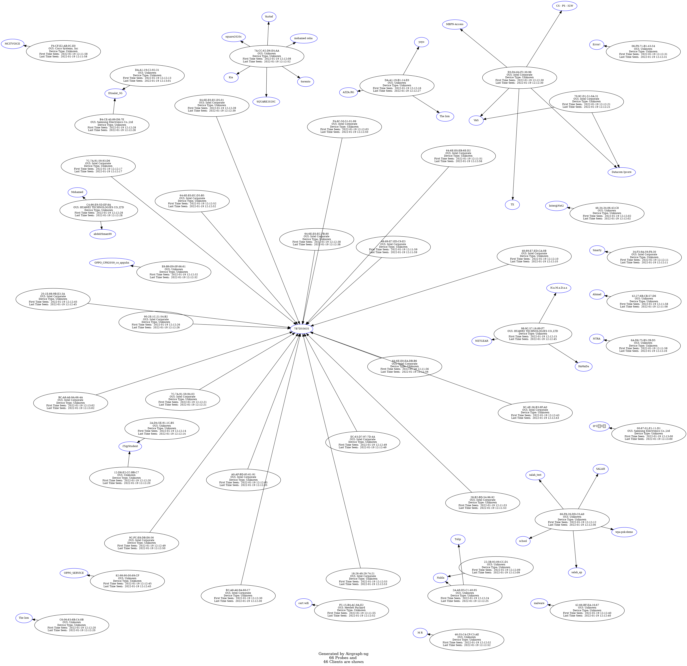

# airgraph-ng

- python script
- takes csv comming out of airodump-ng
- convert it to graph

[github repo](https://github.com/aircrack-ng/aircrack-ng/tree/master/scripts/airgraph-ng)


```bash
└─$ git clone https://github.com/aircrack-ng/aircrack-ng.git 

└─$ sudo apt install python2                                               

└─$ sudo python2.7 ./airgraph-ng 

└─$ sudo airmon-ng start wlan1 

└─$ sudo python2.7 ./airgraph-ng -i ./airgraphinput-01.csv -o image1.png -g CAPR

```



```bash
└─$ sudo python2.7 ./airgraph-ng -i ./airgraphinput-01.csv -o image1.png -g CPG 

```

